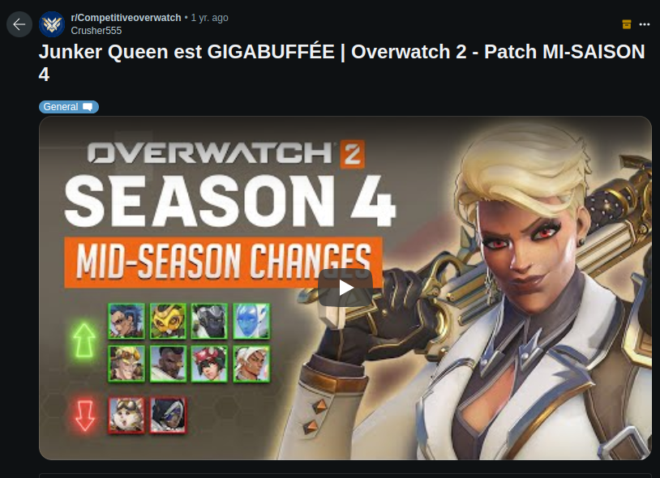
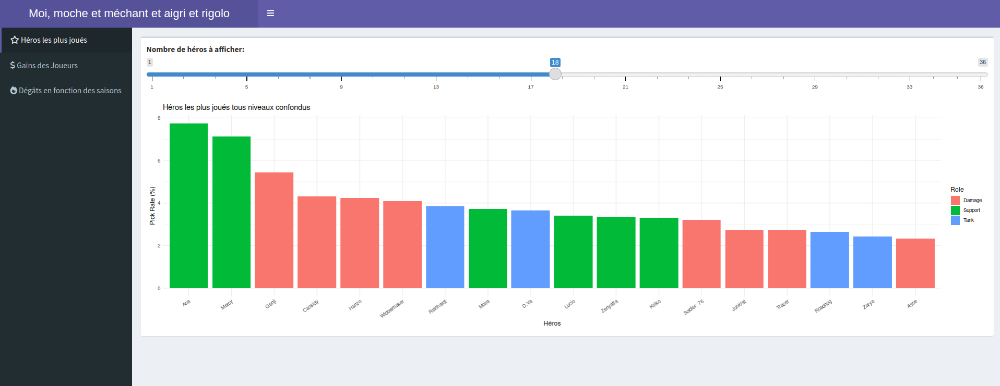
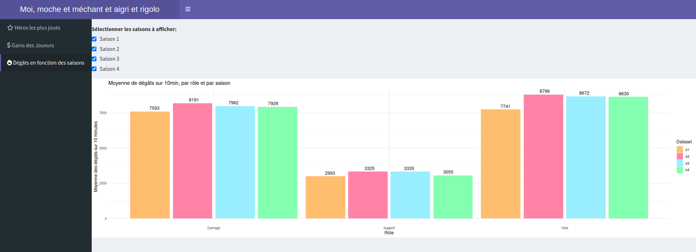
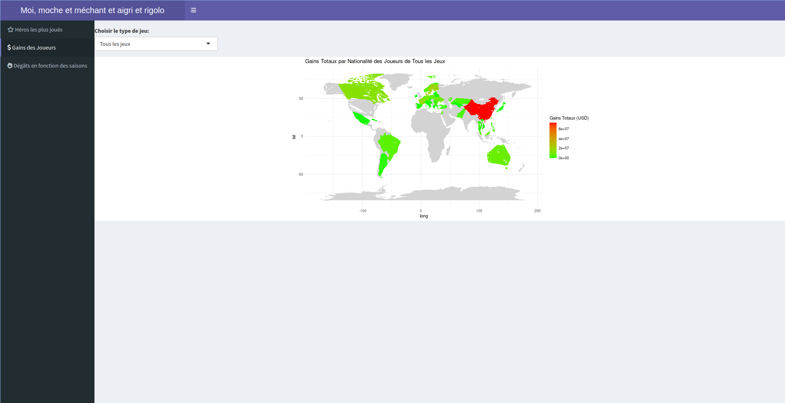

---
---
---

# Introduction

# Données

Les données viennent du site kaggle, nous les avons choisis car on voulait travailler sur un jeu-vidéo que nous aimons. Nous les avons également choisi car on a trouvé plusieurs dataset complémentaires et riche. Elles s'intègrent dans le contexte de l'esport et plus particulièrement dans le jeu-vidéo Overwatch

Nous avons 4 dataset différents donc nous allons faire 4 parties afin que ce soit plus clair. \## Overwatch 2 statistics

Les données ont été ajoutées par Mykhailo Kachan, qui les a pris du site Overbuff\
Ce dataset présente des statistiques sur les héros Overwatch (pick rate, pourcentage de victoires, dégats, etc...) en fonction du niveau du joueur (de bronze à diamand) et des saisons.

Le dataset se compose de 131 variables et 288 observations ; les colonnes les plus précises ne seront pas étudiées car leur contenu trop pointu ne nous intéresse pas. Nous nous intéresserons à une dizaine de colonnes :

**Hero** : Nom du héros (type texte, ex. Ana, Mercy)\
**Skill tier** : Définit le niveau de classement du joueur (type texte, 8 valeurs possibles : All, Bronze, Silver, Gold, Platinium, Diamond, Master ou Grandmaster)\
**KDA Ratio** : La somme de kills et des assistances divisée par le nombre de fois où le joueur est mort (type numérique)\
**Pick rate** : Le taux de sélection de chaque héros en jeu (type numérique)\
**Win Rate** : Le taux de victoire de chaque héros (type numérique)\
**Eliminations / 10min** : Nombre d'éliminations en moyenne sur 10 minutes de jeu (type numérique)\
**Damage / 10 min** : Nombre moyen de dégâts du héros sur 10 minutes de jeu (type numérique)\
**Healing / 10 min** : Nombre moyen de points de vie récupéré/redonné sur 10 min de jeu (type numérique)\
**Role** : Rôle du héros en jeu (type texte, trois valeurs possibles : Damage, Tank ou Support)

Ce dataset est divisé en 5 parties : Une première reprend les infos ci-dessus en général depuis que le jeu est sorti. Les quatres suivantes correspondent aux mêmes données mais pour chaque saison.

## eSports Earnings

Les données du dataset proviennent du site eSportsEarning.com , ce dataset comporte 3 parties distinctes :

1.  country-and-continent-codes-list.csv **Nombre d’observations** (lignes) : 262\
    **Nombre de variables** (colonnes) : 6\
    Détails des variables :

| Nom de variable           | Définition de variable    | Type de variable                                |
|-------------------|-------------------|----------------------------------|
| Continent_Name            | Nom du continent          | type texte, 7 valeurs uniques, ex. Asia, Europe |
| Continent_Code            | Code du continent         | type texte, 6 valeurs uniques, ex. AS, EU       |
| Country_Name              | Nom complet du pays       | type texte, 254 valeurs uniques                 |
| Two_Letter_Country_Code   | Code pays à deux lettres  | type texte, 253 valeurs uniques                 |
| Three_Letter_Country_Code | Code pays à trois lettres | type texte, 250 valeurs uniques                 |
| Country_Number            | Numéro du pays            | type numérique, 250 valeurs uniques             |

Les données peuvent être regroupées par continent (Continent_Name et Continent_Code), offrant une catégorisation géographique des pays (Country_Name, Two_Letter_Country_Code, Three_Letter_Country_Code). Ce fichier semble principalement fournir une correspondance entre les pays et leur appartenance continentale, sans sous-groupes internes évidents au-delà de cette classification géographique.

2.  highest_earning_players.csv

**Nombre d’observations**: 96\
**Nombre de variables** : 8\
Détails des variables :

| Nom de variable | Définition de variable   | Type de variable                        |
|-------------------|-------------------|----------------------------------|
| PlayerId        | Identifiant du joueur    | type numérique, 998 valeurs uniques     |
| NameFirst       | Prénom du joueur         | type texte, 756 valeurs uniques         |
| NameLast        | Nom de famille du joueur | type texte, 637 valeurs uniques         |
| CurrentHandle   | Pseudo actuel du joueur  | type texte, 990 valeurs uniques         |
| CountryCode     | Code pays du joueur      | type texte, 56 valeurs uniques          |
| TotalUSDPrize   | Total des gains en USD   | type numérique                          |
| Game            | Jeu                      | type texte, 10 genres de jeu différents |
| Genre           | Genre du jeu             | type texte, 5 genres différents         |

Les données sont organisées autour des joueurs et leurs gains dans différents jeux vidéo. Catégories Principales : Les joueurs peuvent être catégorisés par le jeu (Game) auquel ils participent, et par genre de jeu (Genre), comme les jeux de tir à la première personne ou les arènes de bataille en ligne multijoueur. Sous-groupes Possibles : Au sein de chaque jeu ou genre, des analyses peuvent être effectuées sur des sous-groupes, tels que les joueurs par pays (CountryCode), ou les tranches de gains (TotalUSDPrize).

3.  highest_earning_teams.csv

**Nombre d’observations** : 87\
**Nombre de variables** : 6\
Détails des variables :

| Nom de variable  | Définition de variable      | Type de variable                        |
|-------------------|-------------------|----------------------------------|
| TeamId           | Identifiant de l'équipe     | type numérique, 505 valeurs uniques     |
| TeamName         | Nom de l'équipe             | type texte, 505 valeurs uniques         |
| TotalUSDPrize    | Total des gains en USD      | type numérique                          |
| TotalTournaments | Total des tournois disputés | type numérique                          |
| Game             | Jeu                         | type texte, 10 genres de jeu différents |
| Genre            | Genre du jeu                | type texte, 5 genres différents         |

Semblable aux données des joueurs, celles-ci sont organisées autour des équipes et de leurs performances financières dans le domaine des esports. Catégories Principales : Les équipes peuvent être catégorisées par jeu (Game) et par genre de jeu (Genre), offrant un aperçu des domaines où elles ont le plus de succès. Sous-groupes Possibles : Il pourrait y avoir des analyses sur le nombre de tournois disputés (TotalTournaments) par rapport aux gains totaux, ou des comparaisons entre les genres de jeux pour voir où les équipes réussissent le plus.

## Overwatch Heroes

Overwatch_edopic.csv est un dataset décrivant tous les héros présents dans le jeu ainsi que leurs statistiques. C'est un dataset que nous avons trouvé sur le site kaggle. Les personnes ayant publié ce dernier n'ont pas précisé la provenance des données.

Ce fichier est composé de 8 variables et de 58 observations. A savoir qu’il n’y a pas 58 héros dans le jeu, mais quelques-uns possèdent plusieurs formes qui ont des statistiques différentes. Le jeu de données ayant été publié il y a 7ans, les héros qui sont arrivés depuis n’y figurent pas, il faudra donc prendre des pincettes quand aux résultats obtenus puisqu’un total de 12 personnages ne sont pas présents dans ce dataset, et auraient pu changer les résultats.

Description des variables : - Heroes : Nom des héros présents dans le jeu (type texte) - Damage par seconds : Nombre de dégâts infligés par seconde (type numérique) - Headshot DPS : Nombre de dégâts infligés par seconde lorsque tous les tirs touchent à la tête (type numérique, certaines observations sont vides car plusieurs héros ne peuvent pas mettre de « Headshot ») - Single shot : Nombre de dégâts causés par coup/balle (type numérique) - Nanoboost DPS : Nombre de dégâts infligés lorsque le personnage voit ses dégâts augmentés par le Nanoboost de Ana (sa capacité ultime) (type numérique) - Health per Sec : Nombre de soins prodigués par secondes (type numérique, 12 valeurs uniques) - Life : Nombre de points de vie (type numérique) - Reload : Nombre de balles par chargeur (type numérique)

## Professional Overwatch Player Mouse/Sens. Settings

Ce dataset vient de 3 autres datasets qu’une personne à réuni pour son plaisir. Il présente des statistiques à propos des joueurs professionnels d’Overwatch et de leur sensibilité. Principalement la DPI, le modèle de souris ou encore la sensibilité dans le jeu.\
Dans ce premier dataset nous avons 3 fichiers différents, le premier contient 99 observations 6 variables :\
- Model : modèle de la souris (type texte, 99 valeurs uniques, ex. Logitech G Pro, Raze Viper) - Size : taille de la souris (type caractère, 5 valeurs uniques, ex. XS, M, L) - Length : longueur de la souris en cm (type numérique) - GripWidth : la taille de la zone où les utilisateurs vont tenir la souris, en centimètres (type numérique) - Weight : poids la souris en gramme (type numérique) - WeightToSizeRatio : ratio entre le poids de souris et la longueur fois la taille de la zone ou on tient la souris (type numérique)

Le deuxième fichier contient 173 observations et 7 variables :\
- ID : pseudo du joueur (type texte, 173 valeurs uniques) - Team : nom de l’équipe professionnel du joueur (type texte) - Status : statut actif ou non (type texte, 1 valeur unique) - Roles : rôle du joueur (type texte, 3 valeurs uniques, ex. Support, Tank) - HaveSettings : indique si les paramètres du joueurs sont présents dans le fichier suivant (type booléen, 2 valeurs uniques) - Hero : le héro principal joué par le joueur (type texte, 23 uniques valeurs) - TwitchStream : lien vers le twitch du joueur (type texte)

Le troisième fichier contient 148 observations et 12 colonnes :\
- Player : pseudo du joueur (type texte, 148 valeurs uniques) - IsProfessional : vrai si leur ID est présent dans le fichier précédent (type booléen) - Role : rôle du joueur (type texte, 3 valeurs uniques, ex. Tank, Support, Damage) - Hero : le héro principal joué par le joueur (type texte) - MouseModel : modèle de la souris (type texte) - MouseWeight : poids de la souris (type numérique) - MouseWeightToSizeRatio : ratio entre le poids de souris et la longueur fois la taille de la zone ou on tient la souris (type numérique) - DPI : dpi des joueurs (type numérique) - Sensitivity : sensibilité en jeu (type numérique) - eDPI : la dpi multiplié par la sensibilité (type numérique) - cmPer360 : nombre de centimètre d’un mouvement horizontal de la souris pour faire un tour complet dans le jeu (type numérique) - TwitchStream : lien vers le twitch du joueur (type texte)

# Plan d'analyse

## Overwatch 2 statistics

Voici quelques exemple d'interrogations sur ce dataset :

**- Quels héros sont les plus/moins joués ?**

Cette question seule sera difficile à analyser ; on aura des informations sur les héros les plus joués sans pouvoir définir pourquoi. Mais elle deviendra utile liée à d'autres questions ci-dessous, qui pourront (ou non) nous aider à comprendre les raisons poussant les joueurs à jouer certains héros plus que d'autres.

**- Quels héros provoquent le plus/moins de dégâts ?**

Pour cette question, on s'attend à ce que les héros les plus offensifs (ayant le rôle "damage") soient ceux qui provoquent le plus de dégâts en moyenne. Au contraire, nous nous attendons à voir que les héros défensifs (rôle "support") provoquent bien moins de dégâts, sachant que ce n'est pas leur but premier.

**- Quels héros ont le plus/moins de taux de victoire ?**

Il est difficile de prévoir le résultat de cette visualisation. Pour autant, elle peut être intéressante à lier à d'autres questions, ou en la spécifiant plus (par exemple, en se demandant quels sont les rôles des héros ayant le plus de victoires en moyenne, etc.)

**- Comment le ratio des héros a évolué en fonction des saisons ? (augmentation/diminution)**

Étudier l'évolution du KDA ratio des héros en fonction des saisons dans Overwatch pourrait permettre de comprendre les changements de popularité des héros au fil du temps (première question). Cela offre un aperçu des héros qui ont gagné en impact aidant à comprendre les tendances du jeu en fonction des saisons.

Dans l'ensemble, toutes ces questions peuvent être découpées : - En fonction du niveau des joueurs (skill tier) - En fonction des différentes saisons\
Permettant d'étudier sous différents angles toutes nos données.

## eSports Earnings

Voici quelques exemples d'interrogations sur ce dataset :

**- Moyenne des gains des joueurs en fonction de leur nationalité ?**

Cette analyse vise à déterminer si certaines nationalités sont plus susceptibles de gagner des sommes d'argent plus élevées dans le monde d'Overwatch 2. Cela pourrait révéler des tendances intéressantes, comme la possibilité que certaines régions offrent un meilleur soutien, formation, ou plus d'opportunités pour leurs joueurs. Les résultats pourraient indiquer des écarts de performance ou de popularité du jeu selon les pays.

**- Moyenne des gains des joueurs par continent ?**

Semblable à l'analyse par nationalité, mais à une échelle plus large, cette question cherche à comparer les gains moyens sur différents continents. Cela peut aider à comprendre comment les infrastructures régionales, la popularité du jeu, et le niveau de compétition influencent les récompenses financières. Cela pourrait également révéler des continents où le jeu est plus compétitif ou plus prisé.

**- Moyenne de gains des équipes par tournoi ?**

Cette analyse vise à évaluer le succès financier des équipes à travers différents tournois. Cela peut révéler quelles équipes dominent la scène d'Overwatch 2 et comment la distribution des prix varie entre les tournois. Cela peut également aider à identifier des tournois particulièrement lucratifs ou compétitifs.

**- Nationalités des joueurs les mieux payés ?**

En identifiant les nationalités des joueurs les mieux rémunérés, on peut tenter de déduire non seulement où se trouvent les talents les plus prometteurs ou les plus accomplis, mais aussi où le jeu est le plus valorisé. Cette information peut indiquer des tendances de recrutement pour les futures équipes ou des zones cibles pour le développement des ligues et des tournois.

## Overwatch Heroes

Voici quelques exemples d'interrogations sur ce dataset :

**- Quel héros fait le plus de dégâts ?**

Nous pouvons penser que ce sera un DPS puisque leur rôle dans une partie est de faire un maximum de kills et de dégâts. Sachant que Bastion possède une capacité qui lui permet de se transformer en tourelle et tirer avec une énorme cadence, nous pouvons nous attendre que ce soit lui qui sorte en tête du classement. Pour répondre à cette question nous n’aurons qu’à utiliser la variable « Damage per sec » . Afin de donner plus de sens à cette question, nous pourrions élire le personnage qui fait le plus de dégâts par rôle (Tank, DPS, Healer). Pour cela, il faudrait avoir le rôle de chaque personnage pour pouvoir les trier selon leur rôle, mais cette variable n’est pas présente dans le dataset, nous devrons donc la rajouter nous-même.

**- Quel héros fait le plus de dégâts ?**

Nous pouvons penser que ce serait un Tank car ces derniers sont ceux qui sont sensés pouvoir encaisser le plus de dégâts, ceux qui sont en ligne de front. Nous pensons donc à Reinhardt. Pour répondre à cette question, nous aurons à utiliser la variable « life ». Afin de donner plus de sens à cette question, nous pourrions élire le personnage qui a le plus de vie par rôle (Tank, DPS, Healer). Pour cela, il faudrait avoir le rôle de chaque personnage pour pouvoir les trier selon leur rôle, mais cette variable n’est pas présente dans le dataset, nous devrons donc la rajouter nous-même.

**- Quel est le héros avec le plus de soins par seconde ?**

Cette question est importante car elle nous permettrait de savoir quel personnage a le plus de potentiel de soin pour son équipe. Nous nous attendons donc logiquement à ce que ce soit un healer. Nous pouvons penser que le personnage que nous cherchons soit Ange, car celle-ci délivre un flux de soin continu. Pour répondre à cette question, nous utiliserons la variable « Health per Sec ». Le seul problème que nous pourrions rencontrer serait que dans ce dataset se trouvent tous les personnages, ainsi que les formes alternatives qu’ils peuvent prendre selon leurs pouvoir ou leur capacité ultime. Il faudra donc départager les personnages, des personnages sous capacité pour avoir un résultat juste.

## Professional Overwatch Player Mouse/Sens. Settings

Voici quelques exemples d'interrogations sur ce dataset :

**- Est-ce que les joueurs qui jouent le même rôle ont des sensibilités similaires ?**

Nous pensons que oui car chaque rôle a tendance à jouer de la même façon donc les sensibilité des joueurs devraient se ressembler. Pour cette interrogation nous utiliserons les variables Rôle, DPI et Sensitivity. Le problème que nous pourrions rencontrer c’est que des joueurs peuvent avoir une DPI élevé et une sensibilité en jeu basse et certains peuvent avoir l’inverse, mais ces deux paramètres peuvent “renvoyer” une sensibilité similaire dans le jeu.

**- Est ce que les joueurs du rôle damage ont une plus grosse sensibilité afin de pouvoir mettre des flickshot ?**

Nous pensons que oui car la plupart des héros de type damage sont au cœur du combat et ont besoin de réagir très vite. Pour cette question nous utiliserons les variables Rôle, DPI et Sensitivity. Le problème que nous pourrions rencontrer est le même que celui de l’interrogation précédente.

**- Est ce que les joueurs damage privilégient les souris plus légères contrairement aux autres rôles ?**

Dans un premier temps nous aurions eu tendance à penser que oui mais finalement nous ne sommes pas sûrs que le rôle du joueur impact à ce point le poids de la souris. Nous avons donc envie de savoir ce qu’il en est. Pour cette interrogation nous utiliserons Rôle et MouseWeight. Il n’y a pas de problème particulier à part qu’il n’y ait aucune relation entre le rôle et le poids de la souris et donc que nous puissions rien en tirer.

# Analyse du dataset

```{r}
library(dplyr)
library(ggplot2)
library(readr)
library(maps)
library(ggmap)
library(GGally)
```

```{r}
#Importation des données
player_data <- read_csv("./data/player_settings.csv")
data <- read_csv("./data/ow2_quickplay_heroes_stats__2023-05-06.csv")
datas1 <- read_csv("./data/ow2_season_01_FINAL_heroes_stats__2023-05-06.csv")
datas2 <- read_csv("./data/ow2_season_02_FINAL_heroes_stats__2023-05-06.csv")
datas3 <- read_csv("./data/ow2_season_03_FINAL_heroes_stats__2023-05-06.csv")
datas4 <- read_csv("./data/ow2_season_04_FINAL_heroes_stats__2023-06-27.csv")
players <- read_csv("./data/highest_earning_players.csv")
team_data <- read_csv("./data/highest_earning_teams.csv")
country_codes <- read_csv("./data/country-and-continent-codes-list.csv")
heroes <-  read_csv("./data/Overwatch_edopic.csv")
```

## 1) Quels sont les héros les plus/moins joués ?

Comme dit dans l'introduction, cette question seule sera compliquée à analyser ; on aura des informations sur les héros les plus joués sans pouvoir définir pourquoi. Pourtant cette question sera la base pour analyser les visualisations suivantes, ou inversement, les analyses suivantes pourront nous permettre d'expliquer pourquoi certains héros sont plus ou moins joués. 

On pourra aussi dans cette question regarder les rôles des héros les plus joués.

Ici la visualisation utilisée est simplement un graphique en colonnes. J'avais fait une première visualisation en treemap mais le résultat n'étant pas convaincant, les différences n'étaient pas assez marquées pour analyser correctement. J'ai choisi de laisser seulement les 10 premiers et les 10 derniers car mettre tous les héros sur un même graphique le rend illisible et compliqué à analyser. 

D'abord visualisons les 10 héros les plus joués :

```{r}

# Prendre tous les niveaux de joueurs
All_skilltier <- subset(data, `Skill Tier` == "All")

# Héros les plus joués tous niveaux confondus
ggplot(top_n(All_skilltier, 10, `Pick Rate, %`), 
       aes(x = reorder(Hero, -`Pick Rate, %`), y = `Pick Rate, %`, fill = Role)) +
  geom_col() +
  theme_minimal() +
  labs(title = "10 Héros les plus joués tous niveaux confondus", x = "Héros", y = "Pick Rate (%)") +
  theme(axis.text.x = element_text(angle = 35, hjust = 1))

``` 
La première chose à remarquer est que trois héros se démarquent légèrement des autres ; Ana, Mercy et Genji. J'ai modélisé le même graphique pour les joueurs du rang le plus faible et le plus fort, et ce top 3 reste le même à chaque fois, à quelques différences près, je n'ai donc pas inclus les graphiques ici. 

Après quelques recherches internet, j'ai vu que ces trois héros, et dans l'ensemble la plupart de ces 10 héros sont considérés parmis les plus difficiles à jouer ; ils ont donc sûrement une profondeur de jeu qui les rend très puissants quand ils sont bien joués, ce qui les rendent indispensables dans les compositions d'équipes de haut niveau. Pour ce qui est des joueurs plus bas niveau, on peut facilement imaginer qu'ils choisissent des héros joués à très haut niveaux et donc considérés comme les meilleurs héros. 

Il est assez étonnant de voir 4 héros de type Support sur les 10 plus joués ; en effet il n'en existe que 8 sur les 36 héros de mon jeu de données. Cela peut être dû au fait qu'ils sont indispensable dans une composition, ou qu'ils offrent une variété de style de jeu. 


Nos visualisations suivantes nous permettrons peut-être de compléter ou d'amener de nouvelles interprétations à ces résultats.

## 2) Quel sont les 10 héros qui ont le plus haut taux de dégâts par seconde ?

Pour répondre à cette question, nous nous appuierons sur le nombre de dégâts par seconde infligés par chaque héro. On peut s'attendre à trouver une grande partie de personnages Damage dans le lot puisque c'est leur utilité première. Nous ne prendrons dans ce graphique que des héros sans capacité (capacité ultime) puisque ces dernières peuvent fausser les stats.

```{r}
heroes1 <- rename(heroes, Damage_per_sec = `Damage per second`)
heroes1 <- mutate(heroes1, DPS = Damage_per_sec)

#On garde Bastion qui est une exception : il possède deux formes de base dans le jeu
heroes1 <- mutate(heroes1, Heroes = case_when(
  Heroes == "Bastion Recon" ~ "Bastion_Recon",
  Heroes == "Bastion Turret" ~ "Bastion_Turret",
  TRUE ~ Heroes
))
#supprimer tous les héros utilisant une capacité, ex : lucio soundwave
heroes1 <- filter(heroes1, !grepl(" ", Heroes))
heroes1 <- arrange(heroes1, desc(DPS))

top_10_heroes <- head(heroes1, 10)

top_10_heroes <- top_10_heroes %>%
  mutate(Bar_Color = case_when(
    Heroes == "Zenyatta" ~ "Soin",
    Heroes == "Zarya" ~ "Tank",
    TRUE ~ "Soins"
  ))

# Créer le graphique avec les couleurs personnalisées et descriptions
ggplot(top_10_heroes, aes(x = reorder(Heroes, -DPS), y = DPS, fill = Bar_Color, label = DPS)) +
  geom_bar(stat = "identity") +
  geom_text(position = position_dodge(width = 0.9), vjust = -0.5, size = 3) +
  labs(title = "Top 10 héros avec le plus de dégâts par seconde",
       x = "Héros",
       y = "DPS") +
  theme_minimal() +
  theme(axis.text.x = element_text(angle = 45, hjust = 1),
        panel.grid.major = element_blank(),
        panel.grid.minor = element_blank(),
        panel.border = element_blank(),
        panel.background = element_blank(),
        plot.background = element_blank()) +
  scale_fill_manual(values = c("#83ffb0", "#ffbd6e", "#ff83a6"), 
                    name = "Role",
                    labels = c("Soins", "DPS", "Tank"))
```

Observations : A l'exception de Zarya (Tank), et Zenyatta (Soin), nous retrouvons 8 héros de type Dégât dans le top 10, voilà qui confirme nos suppositions. On remarque par contre que Bastion en mode tourelle réalise beaucoup plus de DPS que n'importe quel autre. On pourrait, à première vue, penser que le jeu n'est pas bien équilibré, mais cela s'explique par le fait que Bastion possède deux formes, dont la forme tourelle (Bastion Turret), qui fait de lui une tourelle large et immobile qui tire avec une énorme cadence. Certes le personnage fait beaucoup de dégâts par seconde, mais il prend becoup de place, et est donc très facilement touchable en contrepartie. Ce classement concerne les statistiques théoriques, mais est-ce le cas en jeu ? 

## 3) Quel rôle de héros provoque le plus de dégâts en jeu ?

Pour répondre à cette question, nous nous appuierons sur le nombre de dégâts infligés par les joueurs en 10 minutes, en fonction du rôle de leur héros. 
On s'attend ici à trouver le rôle Damage en première place ; c'est en effet son but principal de provoquer des dégâts.
Au contraire, les dégâts des héros Support devraient être bien inférieurs aux autres, leur but étant de rester à l'arrière du combat, principalement pour soigner leurs coéquipier. 

Après une première visualisation en utilisant un simple diagramme en colonne, je me suis rendu compte qu'il pourrait être intéressant de visualiser la répartition des dégâts en fonction du rôle en plus de la moyenne.
J'ai donc finalement opté pour un diagramme en violon : 

```{r}
# Calculer la moyenne des dégâts pour chaque catégorie de héros
AverageDamage <- data %>%
  group_by(Role) %>%
  summarize(AverageDamage = mean(`Damage / 10min`))

# Graphique en violon
ggplot(data, aes(x = Role, y = `Damage / 10min`, fill = Role)) +
  geom_violin(trim = FALSE) + 
  labs(title = "Distribution des dégâts par catégorie de héros",
       x = "Catégorie de héros",
       y = "Dégâts (10min)") +
  theme_minimal() +
  theme(legend.position = "none",
        panel.grid.major = element_blank(),
        axis.line = element_line(color = "black"),
        axis.text = element_text(size = 12, color = "black"),
        axis.title = element_text(size = 14, color = "black"),
        plot.title = element_text(size = 16, hjust = 0.5, color = "black")) +
  geom_point(data = AverageDamage, aes(x = Role, y = AverageDamage), color = "black", size = 2.5) + # Moyennes
  geom_text(data = AverageDamage, aes(x = Role, y = AverageDamage, label = round(AverageDamage)), vjust = -0.8, size = 3.5, color = "black", fontface = "bold") +
  scale_fill_manual(values = c("#199ace", "#4dd3f1", "#1632b0"))

``` 

Plusieurs observations peuvent être faites grâce à ce graphique : 

Tout d'abord, les héros de type support ont en effet une moyenne de dégâts bien moins élevées que celle des autres rôles. C'est un résultat qui est attendu et sans surprise. 

Par contre, contrairement à nos hypothèses, on peut remarquer le rôle Damage ne se démarque pas du rôle Tank. C'est même ce dernier qui à la moyenne la plus haute. Ce résultat peut paraître étonnant si on regarde les résultats de la question précédente ; en effet, au niveau des dégâts par seconde, les héros de type Damage sont les plus puissants.

Mais la question précédente prend en compte seulement les statistiques théoriques des héros. Dans le cas de ce diagramme, les données sont des statistiques réelles, prises en jeu. Alors même si les héros de rôle Damage sont plus puissant en théorie, les type Tank sont toujours au front. Ils ont plus de vie, et donc plus de temps pour mettre des dégâts aux autres joueurs avant de mourir, même si leurs attaques sont moins puissantes. Ceci explique donc l'équilibre entre les dégâts des Tank et des Damage sur 10 minutes de jeu. 

Par contre, on peut remarquer que la distribution des dégâts est bien plus faible chez les tanks, alors qu'elle est bien plus étendue chez les type Damage ; on peut penser que le rôle des tanks n'étant pas principalement de faire des dégâts, leurs statistiques sont assez proches de ce côté-là. Au contraire, c'est le but des héros Damage ; ils ont donc tous leur particularités concernant les dégâts qu'ils vont provoquer, selon la manière de jouer. Ce qui explique la répartition bien plus étendue. 

Les rôles support ont aussi une répartition assez répandue mais il existe assez peu de héros de ce type donc il est difficile d'en tirer des conclusions. 

## 4) Quel est le lien entre le taux de sélection d'un héros et son nombre de dégâts sur 10min ?

Pour trouver cette question, j'ai tout d'abord effectué une matrice avec ggpairs pour essayer de trouver des corrélations entre mes variables de dégâts, de KDA Ratio, de fréquence de choix et de taux de victoires. Le plus haut coefficient de corrélation se trouvait entre le taux de sélection du héros et le nombre de dégâts sur 10min.

Avant de m'y intéresser d'avantage, je pensais logiquement qu'un héros faisant plus de dégâts avait plus de chance d'être choisi, ou alors qu'il n'y avait aucune corrélation entre les deux.

Les deux variables étant quantitatives, j'ai utilisé un nuage de points pour visualiser.


```{r}

# Prendre tous les niveaux de joueurs
All_skilltier <- subset(data, `Skill Tier` == "All")

# Calculer la corrélation
correlation <- cor(All_skilltier$`Pick Rate, %`, All_skilltier$`Damage / 10min`)

# Créer le graphique
ggplot(All_skilltier, 
       aes(x = `Pick Rate, %`, y = `Damage / 10min`)) +
  geom_point(aes(color = Role), size = 3) + 
  geom_smooth(method = lm, se = FALSE, color = "black") + # Ligne de tendance 
  labs(title = "Sélection des héros en fonction des dégâts sur 10min", 
       x = "Fréquence de sélection (%)", 
       y = "Dégâts sur 10min") +
  annotate("text", x = Inf, y = Inf, 
           label = paste("Corrélation:", round(correlation, 3)), 
           hjust = 1.1, vjust = 2, size = 4, color = "black") +
  theme_minimal()

``` 

On peut donc voir que sur ce graphique, le coefficient de corrélation est de -0,593. C'est assez fort pour être noté, mais cela reste un résultat à prendre avec des pincettes car il peut toujours être dû au hasard. 

D'ailleurs, ce résultat est plutôt inattendu. Le coefficient de corrélation négatif nous indique que plus les héros font de dégâts sur 10min de jeu, moins ce sont des héros choisis. 
Il est donc difficile d'interpréter ce graphique et de trouver des raisons à ce potentiel lien. 

En conclusion, bien que ce coefficient de corrélation négatif soit notable, son interprétation nécessiterait une analyse plus approfondie pour tirer des conclusions solides sur la relation entre les éliminations par 10 minutes et le choix des héros.
Ce chiffre peut très bien être dû au hasard.

## 5) Quels joueurs ont le meilleur ratio en jeu ?

Une des manières de comparer les joueurs est de regarder leur KDA Ratio (Kill, Deaths, Assists Ratio), c'est-à-dire le ratio entre le nombre de joueurs tués (ou contribué à tuer) et le nombre de morts du joueur. Un ratio élevé indique généralement une bonne performance, car le joueur participe à plus d'éliminations (kills et assistances) tout en mourant moins souvent. Par exemple, un KDA Ratio de 2 veut dire qu'en moyenne, pour chaque mort, un joueur fera 2 éliminations. 

On peut logiquement penser que plus le joueur à un niveau élevé, plus son ratio sera élevé aussi, car un bon joueur est un joueur qui fait un maximum d'éliminations avec un minimum de morts.

Pour ce graphique, j'ai décidé de faire un boxplot (ou diagramme en boîte et moustache), qui permettra de visualiser la distribution du KDA Ratio par niveau de joueur et de les comparer facilement les unes aux autres.

```{r}
# Convertir la colonne Skill.Tier en facteur avec les niveaux spécifiés
data$`Skill Tier` <- factor(data$`Skill Tier`, 
                            levels = c("Bronze", "Silver", "Gold", "Platinum", "Diamond", "Master", "Grandmaster", "All"))

# Comparaison des KDA par niveau
ggplot(data, 
       aes(x = `Skill Tier`, y = `KDA Ratio`, fill = `Skill Tier`)) +
  geom_boxplot(alpha = 0.7) +
  labs(title = "Comparaison du KDA Ratio par niveau de joueur", 
       x = "Niveau de joueur", 
       y = "KDA Ratio") +
  theme_minimal() +
  theme(axis.text.x = element_text(hjust = 0.3), 
        legend.position = "none") +
  coord_cartesian(ylim = c(2.5, 5))


``` 

Tout d'abord il est important de préciser qu'en abscisse, le ratio varie entre 2.5 et 5. Ces valeurs ont été choisies pour voir au mieux les boxplot. Notre but étant de les comparer entre elles et non de savoir si le ratio est important ou pas, il n'est pas grave d'avoir un graphique qui ne commence pas à 0. 

Ensuite, on peut observer sur ce graphique que du niveau Bronze à Diamant, on observe une augmentation proportionnelle du ratio des joueurs. Puis jusqu'à Grand Maître, le ratio reste à peu près constant. Même si ces différences ne sont pas très élevées, on peut quand même en déduire qu'en effet, il semble y avoir une augmentation du ratio en montant de niveau de jeu, comme imaginé dans les hypothèses. C'est une observation plutôt logique et attendue. 

Pour autant cette croissance reste peu marquée et s'estompe arrivée à plus haut niveau ; cela peut-être expliqué par le fait que quand on monte de niveau, nos adversaires montent de niveau aussi. Ainsi même si un joueur en Grand Maître sera meilleur qu'un joueur en Diamant, comme ses adversaires seront aussi des Grand Maîtres, ils seront plus difficiles à éliminer et donc le ratio du joueur n'augmentera pas forcément.

## 6) Comment les dégâts provoqués ont-ils évolués selon les saisons ?


Mon dataset comprenant des données sur les 4 saisons du jeu, il me paraît intéressant de visualiser l'évolution du jeu et des joueurs. 
Pour cela j'ai décidé de comparer les dégâts sur 10min en jeu, pour les différents rôles et par saison. 

Avant de construire mon graphique, j'avais plusieurs hypothèses ;
Soit le nombre de dégâts augmente avec les saisons, car les joueurs découvrent de mieux en mieux le jeu et donc s'améliorent.
Soit le nombre de dégâts reste à peu près constant, ce qui serait logique aussi car les statistiques des différents héros sont souvent modifiées pour qu'ils soient les plus équilibrés possible. L'objectif des créateurs peut être de garder les stats en jeu constantes en modifiant leurs héros si besoin.

J'ai utilisé un graphique en colonne en regroupant en abscisses par rôle, avec une colonne par saison pour chaque rôle afin d'étudier l'évolution des dégâts par saison facilement. 

```{r}
# Calculer la moyenne des Damage / 10min pour chaque rôle dans chaque dataset
mean_datas1 <- datas1 %>% group_by(Role) %>% summarise(mean_damage = mean(`Damage / 10min`))
mean_datas2 <- datas2 %>% group_by(Role) %>% summarise(mean_damage = mean(`Damage / 10min`))
mean_datas3 <- datas3 %>% group_by(Role) %>% summarise(mean_damage = mean(`Damage / 10min`))
mean_datas4 <- datas4 %>% group_by(Role) %>% summarise(mean_damage = mean(`Damage / 10min`))

# Ajouter une colonne pour identifier les jeux de données
mean_datas1$Dataset <- "Datas1"
mean_datas2$Dataset <- "Datas2"
mean_datas3$Dataset <- "Datas3"
mean_datas4$Dataset <- "Datas4"

# Combiner les moyennes dans un seul dataframe
combined_means <- bind_rows(mean_datas1, mean_datas2, mean_datas3, mean_datas4)

# Choisir les couleurs
color_gradient <- c("#ffbd6e", "#ff83a6", "#98eeff", "#83ffb0")

# Créer le diagramme en colonnes avec les moyennes affichées
ggplot(combined_means, aes(x = Role, y = mean_damage, fill = Dataset)) +
  geom_col(position = position_dodge(width = 0.97), alpha = 1) +
  geom_text(aes(label = round(mean_damage)), position = position_dodge(width = 0.9), vjust = -0.5) +
  labs(title = "Moyenne de dégâts sur 10min, par rôle et par saison",
       x = "Rôle",
       y = "Moyenne des dégâts sur 10 minutes") +
  scale_fill_manual(values = color_gradient) +
  theme_minimal()
``` 
Notre visualisation nous permet de voir qu'en effet, le nombre de dégâts par saison reste à peu près constant pour tous les rôles. On peut donc penser que les créateurs du jeu cherchent à garder les statistiques des joueurs proches d'une saison à une autre, et donc de modifier les capacités des héros en fonction. 

Pourtant, on remarque quand même une légère augmentation pour chaque rôle entre la saison 1 et la saison 2. On peut donc penser que notre première hypothèse n'est pas fausse et qu'en effet, les joueurs se sont améliorés entre ces deux saisons, avant que les héros soient modifiés pour empêcher une trop grosse augmentation avec le temps. 

Ces hypothèses restent discutables, et peut-être que les légères variations visibles sont dûes au hasard ou à d'autres facteurs non étudiés.


## 7) Quels sont les 10 héros qui ont le plus de point de vie?

Pour répondre à cette question, nous nous appuierons sur les points de vie de chaque héros pour en faire un classement. On s'attend donc à retrouver presque exclusivement des tanks, puisque ce sont ceux qui sont censés être en première ligne, et avoir la capacité à encaisser le plus de dégâts.

```{r}
heroes2 <- filter(heroes, !grepl(" ", Heroes) | Heroes == "D.va Mech" | Heroes == "Roadhog" | Heroes =="Bastion Recon" | Heroes =="Bastion Turret", !is.na(Life))
# Convertir la variable "Life" en entiers
heroes2 <- mutate(heroes2, Life = as.integer(Life))

heroes2 <- arrange(heroes2, desc(Life))
top_10_heroes_life <- head(heroes2, 10)
top_10_heroes_life <- top_10_heroes_life %>%
  mutate(Role = case_when(
    Heroes %in% c("Bastion Recon", "Bastion Turret", "Mei", "Reaper") ~ "DPS",
    TRUE ~ "#ffbd6e"
  ))

ggplot(top_10_heroes_life, aes(x = reorder(Heroes, -Life), y = Life, fill = Role, label = Life)) +
  geom_bar(stat = "identity") +
  geom_text(position = position_dodge(width = 0.9), vjust = -0.5, size = 3) +
  labs(title = "Top 10 héros avec le plus de Vie",
       x = "Héros",
       y = "Vie",
       fill = "Role") +
  theme_minimal() +
  theme(axis.text.x = element_text(angle = 45, hjust = 1),
        panel.grid.major = element_blank(),
        panel.grid.minor = element_blank(),
        panel.border = element_blank(),
        panel.background = element_blank(),
        plot.background = element_blank()) +
  scale_fill_manual(values = c("#98eeff", "#ffbd6e"), 
                    labels = c("Tank", "DPS"))

```
On remarque que les tanks sont bien les personnages avec le plus de vie du jeu. Ils sont tous situés entre 400 et 600. La raison pour laquelle zarya n'a que 400 points de vie, est qu'elle possède une capacité qui lui permet de se protéger de tous dégâts pendant quelques secondes. Après les tanks, viennent les dps qui possèdent le plus de points de vie.

## 8) Quels sont les héros avec le plus de soins par seconde?


Pour répondre à cette question, nous nous appuierons sur la statistique de soins par seconde de chaque héro. On s'attend à retrouver tous les healers dans le classement.

```{r}
heroes3 <- rename(heroes, Heal_per_sec = `Health per Sec`)

# Calculer les Heal per seconds pour chaque héros
heroes3 <- mutate(heroes3, HPS = Heal_per_sec)
heroes3 <- filter(heroes3, !grepl(" ", Heroes) & HPS > 1 & Heroes != "Reaper" & Heroes != "Soldier")
heroes3 <- arrange(heroes3, desc(HPS))
top_10_heroes_hps <- head(heroes3, 10)

ggplot(top_10_heroes_hps, aes(x = reorder(Heroes, -HPS), y = HPS, label = HPS)) +
  geom_bar(stat = "identity", fill = "#83ffb0") +
  geom_text(position = position_dodge(width = 0.9), vjust = -0.5, size = 3) +
  labs(title = "Top héros avec le plus de soins par seconde",
  labs(title = "Top 10 héros avec le plus de Heal per seconds (Hors capacités)"),
       x = "Héros",
       y = "Heal per second") +
  theme_minimal() +
  theme(axis.text.x = element_text(angle = 45, hjust = 1),
        panel.grid.major = element_blank(),
        panel.grid.minor = element_blank(),
        panel.border = element_blank(),
        panel.background = element_blank(),
        plot.background = element_blank())
```
Comme attendu, tous les healers apparaissent. IL est bon de noter que dans le dataset que j'utilise, nous n'avons pas les héros les plus récents, c'est pour cette raison qu'il manque quelques personnages dans ce classement. On  note tout de même une énorme différence entre Ana et Lucio, cela s'explique par le fait que Ana ne peut healer qu'un héro à la fois, en lui tirant des seringues soignantes, tandis que lucio possède une zone de heal. Ce dernier a donc un moins gros heal par seconde, mais peut potentiellement soigner tous ses alliés en même temps si ils sont bien placés dans sa zone. Nous avions vu dans le barchart de la question X où nous étudions les héros les plus joués, que les 2 personnages, tout rôles confondus en tête étaient Mercy et Ana. On pourrait donc se demander si, plus le personnage apporte du soin, plus il est choisi par les joueurs.


## 9) Est ce que les healers avec le plus de soin par seconde sont ceux qui sont le plus joués ? 

Nous avions vu dans le graphique 1 les héros les plus joués. Il serait donc intéressant de vérifier si les healers qui prodiguent le plus de soins par seconde sont ceux qui sont aussi les plus utilisés. Pour ce faire, nous allons prendre les 2 datasets nécessaire: celui qui contient la feature PickRate et celui qui contient les stats de soins par seconde. Nous ne garderons que les 4 healers présents dans le dataset utilisé dans les 3 graphiques précédents. Après avoir trié, et fusionné, on se retrouvera avec un seul dataset. Il restera un seul problème: dans le jeu de données contenant la valeur Pick Rate, chaque héro est cité plusieurs fois, car son taux d'utilisation diffère selon l'élo dans lequel il est joué (bronze, argent, or etc..) J'ai donc choisi de faire la moyenne de ce taux, pôur avoir un aperçu global. Une fois la dataset fusionné, avec les bons héros et un seul Pick Rate à chaque fois, nous pourrons créer un nuage de points pour déceler une tendance ou non.

```{r}
# Renommer les colonnes pour une utilisation plus simple
heroes5 <- rename(heroes, Heal_per_sec = `Health per Sec`)
data2 <- rename(data, Pick_Rate = `Pick Rate, %`)

# Filtrer les healers spécifiques : Ana, Mercy, Zenyatta et Lucio dans le dataset 'heroes'
selected_healers <- filter(heroes5, Heroes %in% c("Ana", "Mercy", "Zenyatta", "Lucio"))

# Agréger les données du dataset 'data' pour obtenir une moyenne de 'Pick Rate' par personnage
average_pick_rate <- data2 %>%
  filter(Hero %in% c("Ana", "Mercy", "Zenyatta", "Lucio")) %>%
  group_by(Hero) %>%
  summarise(Pick_Rate = mean(Pick_Rate))

# Fusionner les deux datasets par les noms des héros
merged_data <- merge(selected_healers, average_pick_rate, by.x = "Heroes", by.y = "Hero")

colors <- c("Ana" = "blue", "Mercy" = "orange", "Zenyatta" = "purple", "Lucio" = "green")

ggplot(merged_data, aes(x = Pick_Rate, y = Heal_per_sec, color = Heroes)) +
  geom_point(size = 3) +
  labs(title = "Relation entre le taux de sélection et les soins par seconde pour les healers",
       x = "Taux de sélection (%)",
       y = "Soins par seconde (HPS)") +
  theme_minimal() +
  theme(legend.position = "right") +  # Positionnement de la légende sur la droite
  scale_color_manual(values = colors)  # Utilisation des couleurs définies précédemment
```

Le taux de sélection correspond à tous les héros confondus, le taux de personnes qui prennent le personnage X. Une fois encore, nous ne trouvons pas réellement de tendance. Nous pouvons tout de même noter que Ana et Mercy sont les héros qui font le plus de soins, et sont les deux les plus utilisés. Bien que Zenyatta heal plus que Lucio, ce dernier se retrouve quand même au dessus, sûrement parce que zen ne peut healer qu'une personne à la fois, tandis que lucio peut ditribuer du soin à plusieurs alliés à la fois. Pour Mercy, cela peut être dû au fait que cette dernière peut utiliser une de ses capacités pour réanimer des alliés. Il est évident que l'on ne peut pas tirer de résultats précis avec 4 éléménts, pourtant, dans ce cas précis, nous pouvons tout de même théoriser que plus un héro apporte du soin, plus il sera sélectionné. Cette hypothèse peut tout à fait s'avérer être fausse, mais la différence entre les 2 groupes est énorme (ana et mercy 2 fois plus sélectionnées).

## 10) Est ce qu'il existe une corrélation entre les points de vie des personnages et les dégâts qu'ils infligent?

On pourrait se demander si les personnages qui font le plus de dégâts sont ceux qui ont le moins de points de vie, et inversement. Cette hypothèse peut s'avérer crédible, puisqu"on pourrait se poser des questions sur l'équilibrage si les personnages les plus resistants sont également ceux qui font le plus mal. Nous allons donc essayer de répondre à cette question en faisant un scatterplot, et regarder si une tendance se dessine. Pour se faire, un point représente un personnage, en x, ses points de vie, et en y, ses dégâts.

```{r}
# Bug sur Zarya que je corrigerai donc je ne l'inclus pas pour l'instant, on garde seulement les formes normales des héros
heroes4 <- filter(heroes, !grepl(" ", Heroes) | Heroes == "D.va Mech" | Heroes == "Roadhog" | Heroes =="Bastion Recon" | Heroes =="Bastion Turret", !is.na(Life))

# Nuage de points pour les dégâts par seconde par rapport à la vie
ggplot(heroes4, aes(x = Life, y = `Damage per second`)) +
  geom_point(color = "blue", alpha = 0.6) +
  labs(title = "Relation entre les points de vie et les dégâts de chaque héro",
       x = "Points de vie",
       y = "Dégâts par seconde") +
  theme_minimal()
```
Les valeurs ne suivent aucune tendance. Il n'y a donc aucun rapport entre les points de vie et les dégâts par seconde. Cela peut s'expliquer par le fait qu'une des choses les plus importantes dans Overwatch, ce sont les capacités des héros. Ces dernières ne dépendent pas de leurs points de vies, ou de leur dégâts mais son propre à chacun selon les personnages et peuvent totalement changer l'issu d'un combat.

## 11) Quelle est la distribution de la sensibilité des joueurs, et y a-t-il des tendances notables ?

On s'attend à ce que les joueurs aient globalement une sensibilité similaire. Mais il y a toujours des joueurs qui ont des façons de jouer différentes que ce soit l'inclinaison du clavier ou encore la façon de tenir la souris donc ça ne nous étonnerait pas s'il y a quelques joueurs qui sortent du lot.

```{r}
dpi_reference <- 800

player_data$Sensitivity <- as.numeric(player_data$Sensitivity)
player_data$DPI <- as.numeric(player_data$DPI)

player_data <- player_data %>% 
  mutate(ratio_sensibilite = Sensitivity / DPI,
         sensibilite_standardisee = ratio_sensibilite * dpi_reference)

max_count <- max(ggplot_build(ggplot(player_data, aes(x = sensibilite_standardisee)) +
                                geom_histogram(binwidth = 2))$data[[1]]$count)


ggplot(player_data, aes(x = sensibilite_standardisee)) +
  geom_histogram(binwidth = 2, fill = "skyblue", color = "black", boundary = 0) +
  labs(title = "Distribution de la sensibilité de tous les joueurs",
       x = "Sensibilité",
       y = "Nombre de joueurs") +
  scale_x_continuous(breaks = seq(0, max(player_data$sensibilite_standardisee, na.rm = TRUE), by = 2)) +
  scale_y_continuous(breaks = seq(0, max(ggplot_build(ggplot(player_data, aes(x = sensibilite_standardisee)) + 
                                                        geom_histogram(binwidth = 2))$data[[1]]$count, na.rm = TRUE), by = 10)) + 
  theme_minimal()
```
Tout d'abord il faut préciser que dans le jeu de données nous avons 2 informations sur la sensibilité des joueurs. On a la DPI de leur souris et leur sensibilité dans le jeu. Le problème est que ces 2 valeurs n'ont pas du tout le même ordre de grandeur et donc on ne pouvait pas les comparer même en les multipliant par exemple. On a donc réfléchi à comment avoir des valeurs comparables et on a fait un ratio en divisant la sensibilité par la DPI et en multipliant par une DPI de référence ici 800.

Comme on avait pu le prédire, la sensibilité dite "normale" a l'air de se situer autour des 1 à 8. La plupart des joueurs sont entre 4 et 6 et deux grande partie du reste se situe autour de ces valeurs. 

Nous avons quelques joueurs avec des sensibilités extrémements élevés : ici entre 16 et 18 et entre 22 et 24. Comme nous l'avions dit précedemment il y a toujours des joueurs qui ont une façon de jouer bien à eux et cela prouve qu'il n'y a pas de norme mais que chacun joue comme il se sent le mieux. 

Les joueurs avec une sensibilité au-dessus de 8 sont également assez rares avec une dizaine entre 8 et 10 et 5 joueurs entre 10 et 14.

## 12) Est-ce que les joueurs qui joue le même rôle ont des sensibilités similaires ?

On peut effectivement s'attendre à ce que les mêmes rôles partagent globalement la même façon de jouer et ont donc des sensibilités similaires.

```{r}

library(ggplot2)
library(dplyr)

player_data$Sensitivity <- as.numeric(player_data$Sensitivity)
player_data$DPI <- as.numeric(player_data$DPI)

dpi_reference <- 800
player_data <- player_data %>% 
  mutate(ratio_sensibilite = Sensitivity / DPI,
         sensibilite_standardisee = ratio_sensibilite * dpi_reference)

AverageSensibility <- player_data %>%
  group_by(Role) %>%
  summarize(AverageSensibility = mean(sensibilite_standardisee))

ggplot(player_data, aes(x = Role, y = sensibilite_standardisee, fill = Role)) +
  geom_violin(trim = FALSE) +
  labs(title = "Distribution des sensibilités par rôle",
       x = "Rôle", y = "Sensibilités") +
  theme_minimal() +
  theme(legend.position = "none",
        panel.grid.major = element_blank(),
        axis.line = element_line(color = "black"),
        axis.text = element_text(size = 12, color = "black"),
        axis.title = element_text(size = 14, color = "black"),
        plot.title = element_text(size = 16, hjust = 0.5, color = "black")) +
  geom_point(data = AverageSensibility, aes(x = Role, y = AverageSensibility), color = "black", size = 2.5) + 
  geom_text(data = AverageSensibility, aes(x = Role, y = AverageSensibility, label = round(AverageSensibility, 1)), vjust = -0.8, size = 3.5, color = "black", fontface = "bold") +
  scale_fill_manual(values = c("#66c2a5", "#fc8d62", "#8da0cb"))

```

Pour le rôle Damage, les sensibilités sont étendues mais reste tout de même entre 2 et 8-9. Il y a un ou deux joueurs qui ont une sensibilité vraiment différente et bien plus élevée.

Pour le rôle Support, les sensibilités sont déjà plus étendues allant de 2 à 11 avec quelques exceptions au-dessus de 11 jusqu'à 16.

Et pour le rôle Tank, elles sont aussi relativement étendues allant de 2 à 15 avec tout de même beaucoup de joueurs aux alentours de 6.

Pour conclure les joueurs qui jouent le même rôle n'ont pas forcément la même sensibilité car on peut observer une large gamme dans les trois rôles. On observe quand même une sensibilité avec une fréquence élevée pour les rôles Support et Tank à 4 et 6 respectivement.

Nous avons également ajouté la moyenne des sensibilités sur le graphique plutôt que d'en faire un à part entière. 
On peut s'attendre à ce que les joueurs damage aient une plus sensibilité car ils sont au coeur du combat et pourraient avoir besoin de se retourner plus souvent par exemple.

Nos attentes étaient donc fausses, c'est le rôle Tank qui a en moyenne une plus grosse sensibilité. 
Le rôle Damage a carrément une plus petite sensibilité que le rôle Support.
On ne sait pas vraiment comment l'expliquer, on ne pense simplement que le choix du rôle n'impact pas tant que ça la sensibilité. 

## 13) Est ce que les joueurs damage privilégient les souris plus légères contrairement aux autres rôles ?

On peut s'attendre à ce que ce soit le cas pour les mêmes raisons que la moyenne des sensibilités mais peut-être que le poids de la souris n'est pas si determinant pour la façon de jouer.

```{r}
ggplot(player_data, aes(x = Role, y = MouseWeight, fill = Role)) +
  geom_violin() +
  labs(title = "Répartition des poids de souris par rôle",
       x = "Rôle", y = "Poids de la souris (g)") +
  theme_minimal()
```

Le poids des souris du rôle Damage est très étendu, entre 50 et 120.
Pour le rôle Support c'est entre 50 et 112 et pour Tank entre 60 et 112.
On remarque une tendance pour tous les rôles autour des 80-90 et quelques exceptions dans chaque rôle avec des souris plus légères et plus lourdes.

Mais comme pour la question précédente, le rôle n'impact pas clairement le poids de la souris. Ces deux questions sont un peu "décalées" de la réalité car on pensait qu'il pouvait avoir une différence notable mais le gameplay entre Damage et les autres rôles ne doit pas tant différer que ça. 
Peut-être que dans d'autres jeux les rôles Damage ou Duellist ont vraiment des sensibilités très différentes et des souris plus légères mais ce n'est pas le cas pour Overwatch.

## 14) Y a t-il eu des grosses différences de pick rate au fil des saisons ?

On peut imaginer que oui car selon les patchs de mise à jour certains héros sont améliorés ou désavantagé.

```{r}
library(dplyr)
library(ggplot2)
library(scales)

# Fonction pour calculer le pick rate moyen par saison pour chaque héros
calculate_pick_rate <- function(data, season) {
  data %>%
    group_by(Hero) %>%
    summarise(Pick_Rate = mean(`Pick Rate, %`), Season = season)
}

# Charger et préparer les données pour chaque saison
pick_rate_s1 <- calculate_pick_rate(datas1, "Saison 1")
pick_rate_s2 <- calculate_pick_rate(datas2, "Saison 2")
pick_rate_s3 <- calculate_pick_rate(datas3, "Saison 3")
pick_rate_s4 <- calculate_pick_rate(datas4, "Saison 4")

# Combiner les données de toutes les saisons
all_pick_rate <- bind_rows(pick_rate_s1, pick_rate_s2, pick_rate_s3, pick_rate_s4)

# Créer le graphique
top_heroes <- all_pick_rate %>%
  group_by(Hero) %>%
  summarize(Evolution = diff(range(Pick_Rate)) / first(Pick_Rate)) %>%
  arrange(desc(Evolution)) %>%
  head(5) %>%
  pull(Hero)

# Filtrer les données pour inclure uniquement les cinq héros avec la plus grande évolution
filtered_pick_rate <- all_pick_rate %>%
  filter(Hero %in% top_heroes)

# Assurez-vous que les données sont triées par saison
filtered_pick_rate <- filtered_pick_rate %>%
  arrange(Hero, Season)

# Créer le graphique avec les données filtrées
ggplot(filtered_pick_rate, aes(x = Season, y = Pick_Rate, color = Hero, group = Hero)) +
  geom_line() +
  geom_point() + # Ajouter les points pour mieux visualiser les données
  labs(title = "Évolution du pick rate des 5 héros avec la plus grande évolution",
       x = "Saison", y = "Pick Rate, %") +
  theme_minimal()


```
Sur le graphique on a affiché seulement les 5 héros avec la plus grosse évolution car on ne pouvait pas représenter tous les héros.
Cependant pour Wrecking Ball, Symmetra et Echo l'évolution est minime, variant entre 0 et 2% tout au long des 4 saisons.
Par contre pour Cassidy et Junker Queen on peut voir une évolution.

Pour Cassidy on remarque un pic à 8% lors de la saison 3. Après quelques recherches sur internet, on a trouvé que lors de la saison 3 Cassidy a été buff. Sans rentrer dans les détails car c'est plus compliqué qu'une hausse de dégâts ou de vie, ce buff lui permet de se déplacer plus facilement sur la carte et de tirer plus loin. C'est donc pour cela que les joueurs l'ont plus joué lors de cette saison.
On a également cherché les nerfs de la saison 4 pour voir si Cassidy s'y trouvait ce qui pourrait expliquer le retour en dessous de 4% de pick rate. Et on l'a effectivement trouvé, diminution des points de vie et réduction des dégâts de sa grenade ce qui désavantage grandement ce héro.

Pour Junker Queen la hausse est observée lors de la saison 4, en tapant sur internet "junker queen saison 4 buff" on comprend vite que c'est le cas. Des gros titres comme "Insane JunkerQueen Buffs" ou encore "JunkerQueen is GIGABUFFED" nous font comprendre que c'est effectivement le cas, la hausse de son pick rate vient d'une augmentation de ses capacités. On y retrouve une augmentation de la taille du chargeur ou encore un soin plus rapide. Ces améliorations font qu'elle est désignée comme le tank le plus fort et domine tout les matchs.
Voici un exemple de post reddit pour le buff de JunkerQueen pour la saison 4.




## 15) Est-ce que le taux de victoire des héros varie beaucoup selon les ranks ?

On peut imaginer que oui car certains héros doivent nécessiter plus d'expérience pour être joué correctement.

```{r}
library(ggplot2)
library(dplyr)

# Ordre des niveaux de compétence
skill_levels <- c("Bronze", "Silver", "Gold", "Platinum", "Diamond", "Master", "Grandmaster")

# Filtrer les données pour exclure les lignes où Skill Tier est "All"
filtered_data <- data %>%
  filter(`Skill Tier` != "All")

# Convertir la colonne `Skill Tier` en facteur avec les niveaux spécifiés
filtered_data <- filtered_data %>%
  mutate(`Skill Tier` = factor(`Skill Tier`, levels = skill_levels))

# Calculer la différence de taux de victoire entre le niveau de compétence le plus bas et le plus élevé pour chaque héros
win_rate_diff <- filtered_data %>%
  group_by(Hero) %>%
  summarize(
    min_win_rate = min(`Win Rate, %`, na.rm = TRUE),
    max_win_rate = max(`Win Rate, %`, na.rm = TRUE),
    win_rate_diff = max_win_rate - min_win_rate
  )

# Sélectionner les 5 héros avec la plus grande amélioration
top_5_heroes <- win_rate_diff %>%
  arrange(desc(win_rate_diff)) %>%
  head(5)

# Filtrer les données pour ne garder que les héros sélectionnés
selected_data <- filtered_data %>%
  filter(Hero %in% top_5_heroes$Hero)

# Créer le graphique linéaire
ggplot(selected_data, aes(x = `Skill Tier`, y = `Win Rate, %`, color = Hero, group = Hero)) +
  geom_line(size = 1) +
  geom_point(size = 2) +
  labs(title = "Évolution du Win Rate des 5 héros avec la meilleure amélioration",
       x = "Rank",
       y = "Taux de victoire (%)") +
  theme_minimal() +
  theme(plot.title = element_text(size = 16, hjust = 0.5),
        axis.text.x = element_text(angle = 45, hjust = 1),
        axis.title = element_text(size = 14),
        legend.title = element_text(size = 12),
        legend.text = element_text(size = 10))


```
Encore une fois on représente seulement les 5 héros avec l'évolution la plus flagrante car on ne peut pas tous les visualiser.

En général, on voit que les taux de victoire des héros augmentent à mesure que les rangs montent. Les joueurs de rangs plus élevés comprennent mieux comment utiliser les compétences des héros et ils sont plus coordonnés en équipe. Ils savent vraiment comment tirer le meilleur parti de leurs personnages, ce qui se traduit par de meilleurs résultats. Et quand les équipes jouent bien ensemble, ça fait une grosse différence dans le taux de victoire.
De plus les joueurs de haut niveau s'entrainent rigoureusement et connaissent parfaitement leur héros ce qui augmente leur taux de victoire.

## 16) Quelle est la moyenne des gains des joueurs en fonction de leur nationalité ?

Pour répondre à cette question, nous allons d'abord fusionner les données des joueurs avec les données des pays pour obtenir le nom complet des pays. Ensuite, nous allons agréger les gains des joueurs par nationalité et calculer la moyenne des gains pour chaque pays. Enfin, nous allons créer un graphique à barres horizontales pour visualiser les moyennes des gains par nationalité. Nous nous attendons à voir des disparités significatives dans les gains moyens des joueurs en fonction de leur nationalité. Les pays avec une industrie de l'e-sport plus développée ou des opportunités de tournois plus nombreuses pourraient avoir des gains moyens plus élevés. À l'inverse, les pays avec moins de soutien financier ou d'infrastructures pourraient avoir des gains moyens plus bas.
```{r}
# Filtration des joueurs d'Overwatch
overwatch_players <- players[players$Game == "Overwatch", ]
overwatch_players$CountryCode <- tolower(overwatch_players$CountryCode)

# Préparer les données de pays
country_codes$Country_Name <- sub(",.*", "", country_codes$Country_Name)
country_codes$Two_Letter_Country_Code <- tolower(country_codes$Two_Letter_Country_Code)

# Fusion des données de joueurs et de pays
merged_data <- merge(overwatch_players, country_codes, by.x = "CountryCode", by.y = "Two_Letter_Country_Code", all.x = TRUE)

# Calcul des gains totaux par pays
total_earnings <- aggregate(TotalUSDPrize ~ Country_Name, data = merged_data, FUN = sum, na.rm = TRUE)
total_earnings <- total_earnings[order(-total_earnings$TotalUSDPrize),]
total_earnings$Country_Name <- tolower(total_earnings$Country_Name)

# Chargement des données cartographiques
world_map <- map_data("world")
world_map$region <- tolower(world_map$region)

# Fusion des données cartographiques avec les gains totaux
map_data <- merge(world_map, total_earnings, by.x = "region", by.y = "Country_Name", all.x = TRUE)

# Création de la carte avec ggplot2
ggplot(map_data, aes(x = long, y = lat, group = group, fill = TotalUSDPrize/1000)) +
  geom_polygon() +
  scale_fill_gradient(
    low = "green", 
    high = "red", 
    na.value = "lightgrey", 
    name = "Gains Totaux (en milliers USD)", 
    limits = c(0, max(map_data$TotalUSDPrize/1000, na.rm = TRUE))  # Définir les limites de l'échelle à partir de 0
  ) +
  coord_fixed(1.3) +  # Cela aide à maintenir les proportions correctes sur la carte
  labs(title = "Total des Gains par Nationalité des Joueurs d'Overwatch") +
  theme_minimal()

```
Cette carte montre les gains totaux des joueurs d'Overwatch par nationalité. Les pays avec des gains plus élevés sont représentés en rouge, tandis que les pays avec des gains plus bas sont en vert. On peut voir des disparités significatives dans les gains des joueurs en fonction de leur nationalité. Les pays avec des gains plus élevés pourraient avoir une scène e-sport plus développée, des opportunités de tournois plus nombreuses ou un soutien financier plus important pour les joueurs. À l'inverse, les pays avec des gains plus bas pourraient manquer d'infrastructures ou de soutien pour les joueurs d'e-sport.

Nous allons maintenant vérifier si cela reste vrai pour tous les jeux et pas seulement Overwatch.
```{r}
# Standardisation des codes de pays dans le dataframe des joueurs
players$CountryCode <- tolower(players$CountryCode)

# Préparation des données de pays
country_codes$Country_Name <- sub(",.*", "", country_codes$Country_Name)
country_codes$Two_Letter_Country_Code <- tolower(country_codes$Two_Letter_Country_Code)

# Fusion des données de tous les joueurs et des pays
merged_data <- merge(players, country_codes, by.x = "CountryCode", by.y = "Two_Letter_Country_Code", all.x = TRUE)

# Calcul des gains totaux par pays pour tous les jeux
total_earnings <- aggregate(TotalUSDPrize ~ Country_Name, data = merged_data, FUN = sum, na.rm = TRUE)
total_earnings <- total_earnings[order(-total_earnings$TotalUSDPrize),]
total_earnings$Country_Name <- tolower(total_earnings$Country_Name)

# Chargement des données cartographiques
world_map <- map_data("world")
world_map$region <- tolower(world_map$region)

# Fusion des données cartographiques avec les gains totaux
map_data <- merge(world_map, total_earnings, by.x = "region", by.y = "Country_Name", all.x = TRUE)

# Création de la carte avec ggplot2
ggplot(map_data, aes(x = long, y = lat, group = group, fill = TotalUSDPrize/1000)) +
  geom_polygon() +
  scale_fill_gradient(
    low = "green", 
    high = "red", 
    na.value = "lightgrey", 
    name = "Gains Totaux en milliers (USD)", 
    limits = c(0, max(map_data$TotalUSDPrize/1000, na.rm = TRUE))  # Définir les limites de l'échelle à partir de 0
  ) +
  coord_fixed(1.3) +  # Cela aide à maintenir les proportions correctes sur la carte
  labs(title = "Total des Gains par Nationalité des Joueurs de Jeux Vidéo") +
  theme_minimal()

```

Cette carte confirme les disparités significatives dans les gains des joueurs en fonction de leur nationalité. Les pays avec des gains plus élevés sont représentés en rouge, tandis que les pays avec des gains plus bas sont en vert. Les différences de gains peuvent être attribuées à divers facteurs, notamment le niveau de compétition, le soutien financier, les opportunités de tournois et l'infrastructure de l'e-sport dans chaque pays. Les pays avec des gains plus élevés peuvent avoir des scènes e-sport plus développées, des équipes plus compétitives et des joueurs mieux rémunérés, tandis que les pays avec des gains plus bas peuvent manquer de ressources et de soutien pour les joueurs d'e-sport.


## 17)Quelles nationalités sont les plus communes parmi les 100 joueurs d'Overwatch les mieux payés?

Pour répondre à cette question, nous allons d'abord filtrer les données pour ne conserver que les joueurs d'Overwatch. Ensuite, nous allons calculer les nationalités les plus courantes parmi les 100 joueurs les mieux payés en termes de gains totaux. Enfin, nous allons créer un graphique en barres pour visualiser les nationalités des joueurs les mieux payés.
```{r}
# Filtrer les données pour les joueurs d'Overwatch
overwatch_players <- players[players$Game == "Overwatch", ]
country_codes$Country_Name <- sub(",.*", "", country_codes$Country_Name)
country_codes$Two_Letter_Country_Code <- tolower(country_codes$Two_Letter_Country_Code)
overwatch_players$CountryCode <- tolower(overwatch_players$CountryCode)
head(country_codes$Country_Name)
# Nettoyer les noms des pays dans la table des codes de pays
country_codes$Country_Name <- sub(",.*", "", country_codes$Country_Name)
country_codes$Two_Letter_Country_Code <- tolower(country_codes$Two_Letter_Country_Code)
merged_data <- merge(players, country_codes, by.x = "CountryCode", by.y = "Two_Letter_Country_Code", all.x = TRUE)
# Joindre les données des joueurs avec les codes de pays pour obtenir les noms complets des pays
overwatch_players <- overwatch_players %>%
  left_join(country_codes, by = c("CountryCode" = "Two_Letter_Country_Code"))
# Calculer les nationalités des joueurs les mieux payés dans Overwatch
top_players_by_earnings <- overwatch_players %>%
  arrange(desc(TotalUSDPrize)) %>%
  slice_head(n = 100) %>%
  count(Country_Name, sort = TRUE)  # Trier par le nombre de joueurs par nationalité
# Créer un graphique en barres pour visualiser les données
ggplot(top_players_by_earnings, aes(x = reorder(Country_Name, n), y = n)) +
  geom_col(fill = "steelblue", show.legend = FALSE) +  # Utilisation d'une couleur unique et désactivation de la légende
  labs(title = "Nationalités des 100 Joueurs d'Overwatch les Mieux Payés",
       x = "Pays",
       y = "Nombre de Joueurs") +
  theme_minimal() +
  theme(axis.text.x = element_text(angle = 45, hjust = 1)) 
```
Il est évident que la Corée domine largement, indiquant non seulement un talent et un investissement significatifs dans ce pays pour le jeu, mais aussi une scène compétitive très active et lucrative. La présence prépondérante des joueurs coréens peut refléter des infrastructures de formation avancées et un soutien généralisé pour les eSports. Les autres pays représentés, bien que contribuant également à la scène internationale d'Overwatch, montrent des nombres considérablement plus bas, soulignant la suprématie et l'attrait du niveau compétitif en Corée.

## 18)Quelles sont les meilleures équipes d'Overwatch en termes de gains moyens par tournoi?

Pour répondre à cette question, nous allons d'abord filtrer les données pour ne conserver que les équipes d'Overwatch. Ensuite, nous allons calculer les gains moyens par tournoi pour chaque équipe en divisant le total des gains par le nombre total de tournois auxquels elles ont participé. Enfin, nous allons classer les équipes en fonction de leurs gains moyens par tournoi et créer un graphique en barres pour afficher les 20 meilleures équipes en termes de gains moyens par tournoi.
```{r}
overwatch_team_data <- team_data[team_data$Game == "Overwatch", ]
# Ajouter une nouvelle colonne pour les gains moyens par tournoi directement
overwatch_team_data$AverageEarningsPerTournament <- overwatch_team_data$TotalUSDPrize / overwatch_team_data$TotalTournaments
# Filtrer pour obtenir uniquement les 20 équipes avec les gains moyens les plus élevés
top_teams <- overwatch_team_data %>%
  arrange(desc(AverageEarningsPerTournament)) %>%
  top_n(20, AverageEarningsPerTournament)
# Créer un graphique en barres pour afficher les gains moyens par tournoi de ces équipes
ggplot(top_teams, aes(x=reorder(TeamName, AverageEarningsPerTournament), y=AverageEarningsPerTournament/1000, fill=TeamName)) +
  geom_col(show.legend = FALSE) +
  geom_text(aes(label=round(AverageEarningsPerTournament/1000, 2)), vjust=-0.2, size=2.7, color="black") +
  theme_minimal() +
  theme(axis.text.x = element_text(angle=45, hjust=1, size=12), axis.title.x=element_text(size=14), axis.title.y=element_text(size=14)) +
  labs(title="Top 20 des Équipes Overwatch par Gains Moyens par Tournoi", x="Équipe", y="Gains par Tournoi (milliers USD)")
```
L'analyse du graphique montre une répartition inégale des gains, mettant en évidence la supériorité économique et compétitive de certaines équipes. Les équipes comme San Francisco Shock et Vancouver Titans dominent, illustrant l'impact de stratégies efficaces et d'une excellente gestion de ressources. La position géographique des équipes peut également jouer un rôle dans leurs performances financières, avec des régions comme l'Amérique du Nord et l'Asie-Pacifique étant des foyers d'excellence dans l'e-sport.

## 19)Est-ce que le role influe sur les gains des 100 meilleurs joueur d'overwatch?

Pour répondre à cette question, nous allons d'abord filtrer les données pour ne conserver que les joueurs d'Overwatch. Ensuite, nous allons joindre les données des joueurs avec les données de rôles basées sur les handles correspondants. Nous allons ensuite filtrer les joueurs pour obtenir les 100 joueurs les mieux payés. Enfin, nous allons créer un graphique en boîte pour visualiser la distribution des gains totaux par rôle parmi les 100 meilleurs joueurs d'Overwatch.
```{r}
overwatch_players <- players[players$Game == "Overwatch", ]
average_earnings <- aggregate(TotalUSDPrize ~ Country_Name, data = merged_data, FUN = mean, na.rm = TRUE)
average_earnings <- average_earnings[order(-average_earnings$TotalUSDPrize),]
# Jointure des données des joueurs d'Overwatch avec les données de rôles basée sur les handles correspondants
full_data <- left_join(overwatch_players, player_data, by = c("CurrentHandle" = "Player"))
# Suppression des joueurs sans rôle spécifié
full_data <- full_data %>%
  filter(!is.na(Role) & Role != "")  # Assurez-vous que le rôle n'est ni NA ni une chaîne vide
# Filtration pour obtenir les 100 joueurs les mieux rémunérés
top_players_by_earnings <- full_data %>%
  arrange(desc(TotalUSDPrize)) %>%
  slice_head(n = 100)
# Calcul des gains moyens par rôle parmi ces 100 joueurs
earnings_by_role <- top_players_by_earnings %>%
  group_by(Role) %>%
  summarize(AverageEarnings = mean(TotalUSDPrize), .groups = 'drop')
# Création d'un graphique en barres pour visualiser les gains moyens par rôle
ggplot(top_players_by_earnings, aes(x = Role, y = TotalUSDPrize, fill = Role)) +
  geom_boxplot() +
  labs(title = "Distribution des gains par rôle parmi les 100 meilleurs joueurs d'Overwatch",
       x = "Rôle",
       y = "Gains totaux (USD)") +
  theme_minimal() +
  theme(axis.text.x = element_text(angle = 45, hjust = 1),
        legend.position = "none")  # Supprimer la légende si les couleurs par rôle ne sont pas nécessaires
```
Les trois rôles montrent une variabilité notable dans leurs gains, avec des écarts importants entre les quartiles inférieurs et supérieurs. Cela indique que, bien que certains joueurs dans chaque rôle gagnent des sommes très élevées, d'autres gagnent nettement moins.
La médiane des gains est à peu près similaire entre les rôles, mais les joueurs de rôle "Tank" ont tendance à avoir une distribution légèrement plus étroite comparée à celle des rôles "Damage" et "Support". Cela pourrait suggérer une plus grande cohérence dans les gains parmi les tanks, tandis que les rôles de Damage et Support pourraient voir des extrêmes plus marqués.
Les écarts larges dans les rôles "Damage" et "Support" peuvent refléter l'impact de la performance individuelle et la popularité de certains héros dans ces catégories. Les tanks, souvent essentiels mais moins susceptibles de réaliser des actions spectaculaires, montrent une distribution plus homogène des gains.

## 20)Les gains d'un joueurs sont ils afféctés par leur rôles héros?

Pour répondre à cette question, nous allons d'abord filtrer les données pour ne conserver que les joueurs d'Overwatch. Ensuite, nous allons joindre les données des joueurs avec les données de rôles basées sur les handles correspondants. Nous allons ensuite filtrer les joueurs pour obtenir les 100 joueurs les mieux payés. Enfin, nous allons calculer les gains moyens par rôle et par héros parmi ces 100 joueurs et créer un graphique en barres pour visualiser ces données.
```{r}
overwatch_players <- players[players$Game == "Overwatch", ]
# Jointure des données des joueurs d'Overwatch avec les données de rôles basée sur les handles correspondants
full_data <- left_join(overwatch_players, player_data, by = c("CurrentHandle" = "Player"))
# Suppression des joueurs sans rôle ou héros spécifié
full_data <- full_data %>%
  filter(!is.na(Role) & Role != "" & !is.na(Hero) & Hero != "")  # Assurez-vous que le rôle et le héros ne sont ni NA ni une chaîne vide
# Filtration pour obtenir les 100 joueurs les mieux rémunérés
top_players_by_earnings <- full_data %>%
  arrange(desc(TotalUSDPrize)) %>%
  slice_head(n = 100)
# Calcul des gains moyens par rôle et héros parmi ces 100 joueurs
earnings_by_role_and_hero <- top_players_by_earnings %>%
  group_by(Role, Hero) %>%
  summarize(AverageEarnings = mean(TotalUSDPrize), .groups = 'drop') %>%
  arrange(desc(AverageEarnings))
# Création d'un graphique en barres pour visualiser les gains moyens par rôle et héros
ggplot(earnings_by_role_and_hero, aes(x = Hero, y = AverageEarnings, fill = Hero)) +
  geom_col(show.legend = FALSE) +
  facet_wrap(~Role, scales = "free_x") +
  labs(title = "Gains moyens par Héros et Rôle parmi les 100 meilleurs joueurs", x = "Héros", y = "Gains moyens (USD)") +
  theme_minimal() +
  theme(axis.text.x = element_text(angle = 65, hjust = 1, size = 8))  # Combinaison des ajustements dans une seule instruction
```

<<<<<<< HEAD
<<<<<<< HEAD
Observations : On peut observer que les gains moyens des joueurs d'Overwatch varient considérablement en fonction de leur nationalité. Les États-Unis, la Corée du Sud et la Chine sont les pays avec les gains moyens les plus élevés, tandis que les pays européens et sud-américains ont des gains moyens plus bas. Cela peut refléter les différences dans les infrastructures de l'e-sport, les opportunités de tournois et le soutien financier pour les joueurs professionnels dans ces Pays.
=======
Observations : On peut observer que les gains moyens des joueurs d'Overwatch varient considérablement en fonction de leur nationalité. Les États-Unis, la Corée du Sud et la Chine sont les pays avec les gains moyens les plus élevés, tandis que les pays européens et sud-américains ont des gains moyens plus bas. Cela peut refléter les différences dans les infrastructures de l'e-sport, les opportunités de tournois et le soutien financier pour les joueurs professionnels dans ces Pays.
=======
Le graphique en barres montre les gains moyens par héros et par rôle parmi les 100 meilleurs joueurs d'Overwatch. Les joueurs de chaque rôle ont des héros spécifiques qui semblent être plus rentables en termes de gains. Par exemple, les joueurs de rôle "Damage" semblent avoir des gains plus élevés avec des héros comme Tracer, Genji et Widowmaker, tandis que les joueurs de rôle "Support" ont des gains plus élevés avec des héros comme Mercy, Zenyatta et Ana. Les joueurs de rôle "Tank" semblent avoir des gains plus élevés avec des héros comme Reinhardt, Winston et D.Va. Ces tendances peuvent refléter la popularité, l'efficacité et la demande des héros dans le jeu, ainsi que l'impact de la performance individuelle sur les gains des joueurs.
>>>>>>> e56cbe287173a602c7bfc0e893a3fc1189918831

## Application Shiny



Le premier graphique que nous avons modélisé sur l'application Shiny est celui de la question 1, sur les héros les plus joués. Nous l'avons rendu interactif en permettant à l'utilisateur de choisir le nombre de héros qu'il souhaite afficher, entre 1 et tous les héros (36). Cela permet à un utilisateur curieux d'aller voir au-delà des 10 héros initialement affichés dans la question 1. 


<<<<<<< HEAD
>>>>>>> 8ad3137327356e67bc3697def68c68a1bc7b8463
=======

Enfin, nous avons ajouté le graphique de la question 6, sur l'évolution des dégâts provoqués en fonction des saisons. Dans l'application shiny, l'utilisateur peut choisir les saisons qu'il souhaite afficher. Cela lui permet de choisir uniquement les saisons qui l'intéressent pour plus de lisibilité. 



La première carte permet de visualiser les gains totaux par nationalité des joueurs de jeux vidéo. L'utilisateur peut choisir entre les gains totaux de tous les joueurs de jeux vidéo ou uniquement des joueurs d'un certain jeu. Cela permet de comparer les gains des joueurs dun certain jeu avec ceux de tous les joueurs de jeux vidéo.


Cette image démontre les choix pour afficher les différents jeux
>>>>>>> e56cbe287173a602c7bfc0e893a3fc1189918831

# Conclusion

'Un résumé bref (une page grand maximum) comprenant ce que vous avez pu apprendre sur le jeu de données, les difficultés éventuelles et des pistes pour étendre ou élargir le travail effectué'

Je met des idées comme ça sans faire de phrases : 
Apprentissage : Même si certaines questions ont des réponses attendues, nous en avons appris plus sur les héros les plus joués d'Overwatch et pourquoi, ainsi que les habitudes des joueurs professionnels et leur gains. Cela pourra nous permettre de faire des choix de héros plus réfléchi lors de nos futures parties. 
Difficultés ; dataset de Timo vieux (pas tous les héros)
Pistes pour élargir : utiliser plus les évolutions entre les niveaux de joueurs et les saisons pour saisir les subtilités du jeu. 

Avis des membres du groupe : 

Anne-lise : Cette UE m'a appris d'abord à découvrir R plus en profondeur, mais surtout à réfléchir à comment faire des graphiques clairs, efficaces, et non-biaisés. J'ai aimé que nous ne soyons pas évalués sur notre capacité à faire des graphiques avec un code très compliqué, mais sur le fait d'être capable de se poser des questions et de trouver la meilleure visualisation pour y répondre, même si celle-ci est un simple barchart.
Timo : 
Juliette : Les deux principes que je retiendrai de ce cours sont que l'on peut tromper les gens avec la façon dont on représente les données, et le deuxième c'est qu'il faut prendre du recul sur les questions qu'on se pose car parfois il faut accepter que ça ne mène à aucun interprétation. Cela aurait pu être sympa de faire un cours sur python pour voir la différence avec R mais ce n'est pas la priorité dans l'UE. Et de faire un gouter pour votre anniversaire.
Mathys : J'ai appris à coder en R et à faire des graphiques. J'ai appris à poser des questions et à y répondre avec des graphiques. J'ai appris qu'il est facile de tromper les gens avec des graphiques. Comme Juliette, je penses qu'un gouter pour votre anniversaire serait une bonne idée.
# Annexe 

Pour la partie proposition, chaque membre du groupe a travaillé sur son dataset comme nous en avions 4. Chacun a présenté son dataset et à émis des questions potentielles.

Pour ce qui est de la partie exploration, certains ont pu travailler sur d'autre dataset que le leur mais chacun a fait 5 graphiques.
Anne-Lise a fait les graphiques 1,3,4,5 et 6 et a mis les graphiques 1 et 6 sur l'application Shiny
Timo a fait les graphiques X,X,X,X et X
Juliette a fait les graphiques 11,12,13,14 et 15
et Mathys a fait les graphiques 16,17,18,19 et 20

Tout le monde a travaillé sur la présentation car chacun présentait ses graphiques.
